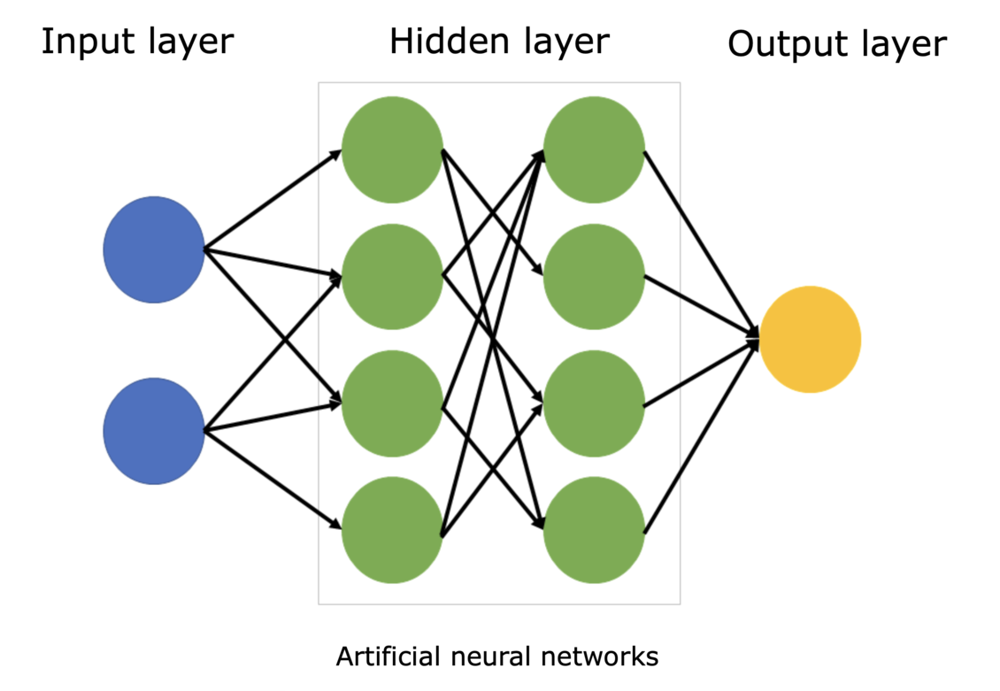
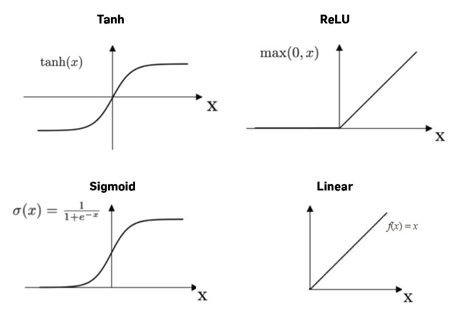
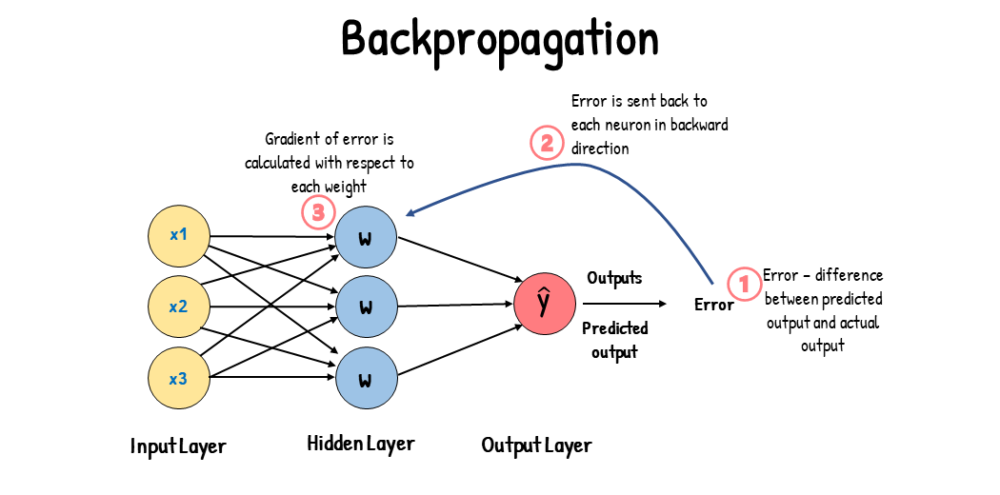
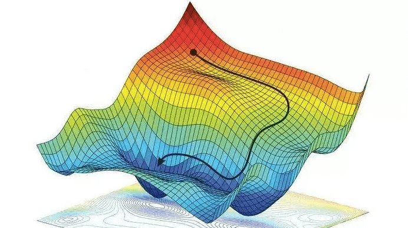
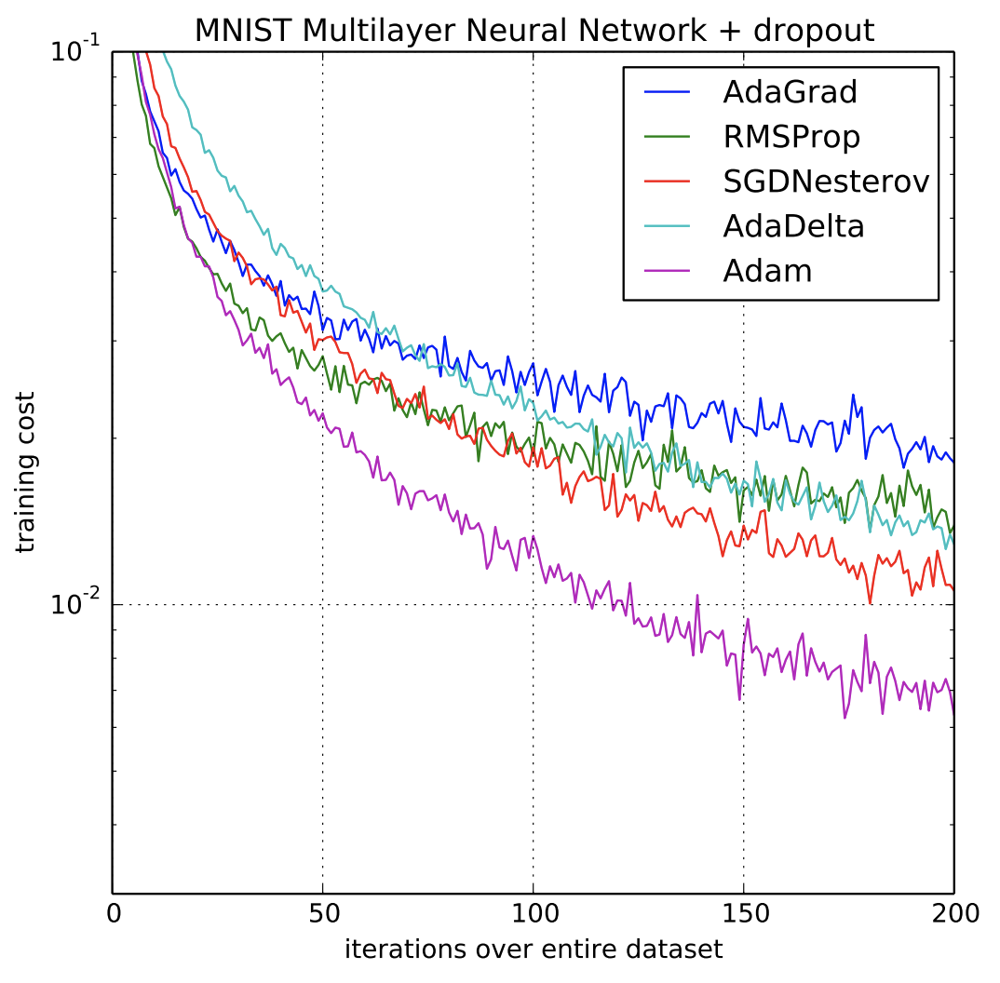

# Day 1

# Day 1: Developing a Minimal Autograd System and a Neural Network

On the first day, we focused on developing a minimal autograd system and a neural network. The main topics covered include:

## What is neural network

A **neural network** is a model inspired by the human brain, used in AI to solve complex tasks like image recognition and natural language processing. Key components include:

-   **Neurons:** Basic units that take inputs, compute, and output.
-   **Layers:** Organized neurons, including input, output, and hidden layers.
-   **Weights and Biases:** Parameters learned during training.
-   **Activation Function:** Applied to each neuron's output to determine signal progression.
-   **Backpropagation and Gradient Descent:** Mechanisms for learning optimal weights and biases.

In essence, a neural network learns by making predictions, comparing to actual values, and updating its parameters to minimize error.

-   [live tensorflow playground](https://playground.tensorflow.org)

## Understanding Automatic Differentiation

### Methods for differentiation

-   **Symbolic Differentiation:** Traditional method using calculus rules.
-   **Automatic Differentiation:** Breaks down a function into basic operations and applies the chain rule.
-   **Numerical Differentiation:** Approximates the derivative using finite difference approximations.
-   **Manual Differentiation:** Applies the rules of differentiation by hand.

#### Automatic differentiation in depth

-   **Automatic Differentiation:** Automatic Differentiation (AD) is a method used to calculate the exact derivatives of a function. It breaks down complex equations into simple parts, calculates the derivatives of these simple parts, and then combines them to get the derivative of the whole function. It's commonly used in machine learning to optimize models.
-   **Forward Mode:** Efficient when inputs < outputs.
-   **Reverse Mode:** Efficient when outputs < inputs, used in backpropagation.
-   **Dual Numbers:** Carry derivative information with function value.
-   **Computational Graph:** Represents function in terms of basic operations.
-   **Chain Rule:** Allows derivative computation of complex functions from simpler ones.

**NOTE** : [Reverse mode Automatic differentiation](https://rufflewind.com/2016-12-30/reverse-mode-automatic-differentiation) plays a crucial role in optimization problems and is extensively used in machine learning algorithms.

## Implementing a Simple Autograd System

We implemented a simple autograd system from scratch based on [Andej Karpathy's micrograd](https://github.com/karpathy/micrograd). This involved creating a `Value` class to represent a scalar value and keep track of the gradients, and defining methods for basic operations like addition, multiplication and functions like tanh,relu,sigmoid etc.

refer the `scet_grad` library in `\day_1` folder to view the autograd source code and testing is done in `grad_test.ipynb` notebook.

## Implementing NN

### activation functions

-   **ReLU (Rectified Linear Unit):** Returns the input for positive values, and zero for negative values. Fast to compute and helps mitigate the vanishing gradient problem.
-   **Tanh (Hyperbolic Tangent):** Outputs values between -1 and 1. Useful when negative outputs are required.
-   **Sigmoid:** Outputs values between 0 and 1. Often used for binary classification problems.

### backpropogation

**Backpropagation** is a method used in neural networks to adjust the weights and biases in response to the error in the network's output. It works by calculating the gradient (or slope) of the error function with respect to the network's weights and biases, and then adjusting those weights and biases in the opposite direction of the gradient to minimize the error. This process is repeated iteratively until the network's performance is satisfactory.

### gradient Descent

Gradient Descent is an algorithm used to find the minimum of a function. It works by iteratively adjusting the input to the function (such as parameters of a model) in the direction that decreases the function's output the most, until it reaches a minimum.

### Loss function

A loss function measures how far the predictions of a machine learning model are from the actual values. It's used to guide the training process to make better predictions.

-   **Mean Squared Error (MSE):** Average of squared differences. Used in regression.
-   **Cross-Entropy:** Measures dissimilarity between predicted and actual distribution. Used in classification.
-   **Hinge Loss:** Used for training classifiers in SVMs.
-   **Log Loss:** Penalizes false classifications. Used in binary classification.

### optimizers

-   **Gradient Descent:** Basic optimizer, adjusts parameters in the direction of negative gradient.
-   **Stochastic Gradient Descent (SGD):** Variation of gradient descent, uses a single random data point instead of the whole dataset to compute the gradient.
-   **Momentum:** Variation of SGD, takes into account the previous steps to speed up convergence.
-   **Adam (Adaptive Moment Estimation):** Combines Momentum and RMSProp (another optimizer), adjusts learning rate for each parameter.

fig : example plot of performance of different optimizers on MNIST multilayer Neural Network

## MISC

-   [DAG](https://en.wikipedia.org/wiki/Directed_acyclic_graph)
-   [BFS](https://en.wikipedia.org/wiki/Breadth-first_search)
-   [DFS](https://en.wikipedia.org/wiki/Depth-first_search)
-   [topological sort](https://www.geeksforgeeks.org/topological-sorting/)
