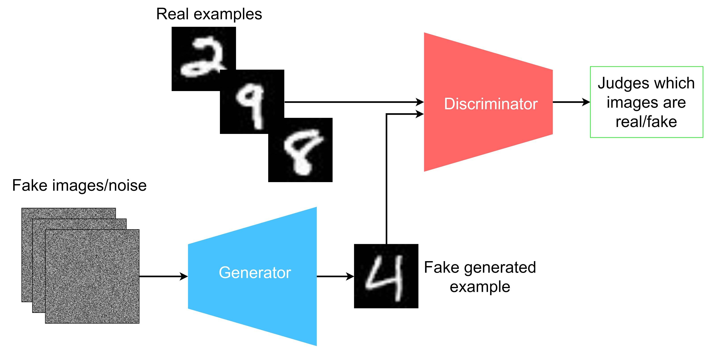
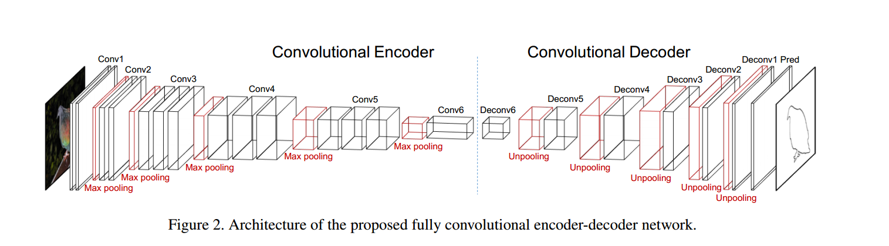

# Day 2: Introduction to PyTorch ,RL & Transformers

On the second day, we delved into the practical aspects of deep learning by introducing and working with production-grade libraries such as PyTorch.

## PyTorch

PyTorch is an open-source machine learning library based on the Torch library. It's used for applications such as computer vision and natural language processing.

- **Tensors:** The fundamental data structure in PyTorch, similar to arrays in NumPy but can also be used on a GPU.
- **Autograd:** PyTorch's automatic differentiation engine that powers neural network training.
- **Neural Networks:** PyTorch provides the `torch.nn` module to help us in creating and training of the neural network.

**NOTE** pytorch intro section in `pytorch_intro` cotains basic pytorch intro jupyter notebooks curated from github repos
- [pytorch-tensor and model intro](https://github.com/buomsoo-kim/PyTorch-learners-tutorial)
- [mnist notebook](https://github.com/jiuntian/pytorch-mnist-example)
## Types of neural networks
### CNN

A **Convolutional Neural Network (CNN)** is a type of neural network used for processing structured grid data like images. It has key components:

- **Convolutional Layer:** Applies filters to extract features.
- **ReLU Layer:** Adds non-linearity to the model.
- **Pooling Layer:** Reduces spatial size to decrease complexity.
- **Fully Connected Layer:** Used for class prediction at the end of the network.

### RNN

A **Recurrent Neural Network (RNN)** is a type of neural network designed for sequence data. It has key components:

- **Input Layer:** Takes sequence of inputs.
- **Hidden Layer:** Has loops to allow information to be passed from one step in the sequence to the next.
- **Output Layer:** Makes prediction for the task at hand.

RNNs are particularly useful for tasks where context and order of input features matter, such as language translation and speech recognition.

### LSTM 

A **Long Short-Term Memory (LSTM)** is a type of RNN designed to remember long-term dependencies in sequence data. Key components include:

- **Forget Gate:** Decides what information to discard from the cell state.
- **Input Gate:** Decides which values from the input to update the cell state.
- **Output Gate:** Decides what next hidden state should be.

LSTMs are useful for tasks like text generation, machine translation, and time series prediction where long-term dependencies exist.

### GAN

A **Generative Adversarial Network (GAN)** is a type of neural network architecture used for generating new data that matches the distribution of the training data. Key components include:

- **Generator:** Creates new data instances.
- **Discriminator:** Determines whether a given instance of data is real (from the training set) or fake (generated).

The generator and discriminator are trained together, with the generator trying to create data that the discriminator can't distinguish from real data, and the discriminator trying to get better at distinguishing real data from fake.

### Encoder - Decoder 

An **Encoder-Decoder** model is a type of neural network architecture used for sequence-to-sequence tasks like machine translation and text summarization. Key components include:

- **Encoder:** Processes the input sequence and compresses the information into a context vector.
- **Decoder:** Takes the context vector and generates the output sequence.

The encoder and decoder are typically RNNs or LSTMs, allowing the model to handle sequences of variable length.

### Diffusion models

A **Diffusion Model** is a type of generative model that simulates a diffusion process to generate new data instances. Key steps include:

- **Start:** Begin with a simple distribution, often Gaussian noise.
- **Diffusion Process:** Gradually refine the simple distribution to match the distribution of the training data.

Diffusion models are used for tasks like image synthesis and denoising, where they can generate high-quality results.

### Transformers

Transformers are a type of model architecture introduced in the paper "Attention is All You Need". They are widely used in NLP for tasks like text translation, sentiment analysis, etc.

- **Attention Mechanism:** The key innovation in Transformer models, allowing the model to focus on different parts of the input sequence when producing output.

The **Attention Mechanism** is a technique used in neural networks to weight the importance of input features. Key components include:

- **Query (Q):** The current context that is used to decide which keys to focus on.
- **Key (K):** These are compared with the query to determine how much focus to place on corresponding values.
- **Value (V):** These are the actual content that the attention scores are applied to.

The attention mechanism computes a weighted sum of the values based on the similarity of the query to the keys. It's used in tasks like machine translation and image captioning to allow the model to focus on different parts of the input when producing the output.

- **Multi-Head Attention:** This is a technique used in Transformer models where the model runs the attention mechanism in parallel (multiple "heads") instead of just once. This allows the model to focus on different positions and capture various aspects of the input information.

- **Masked Attention:** This is used in models like Transformers during training to prevent future tokens from being used in the prediction of the current token. This is done by applying a mask that invalidates certain attention scores in the attention mechanism.

- **Encoder-Decoder Structure:** Transformers typically have an encoder to read the input and a decoder to produce the output.

We implemented these concepts using PyTorch, gaining hands-on experience in building and training these models.